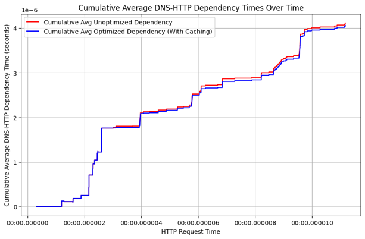

# Cross-Protocol Analysis using Wireshark (DNS & HTTP Optimization)

## Team Members

* Sanggit Saaran K C S (CB.SC.U4AIE23247)
* Surya Ha (CB.SC.U4AIE23267)
* Vishal Seshadri B (CB.SC.U4AIE23260)
* Venkatram K S (CB.SC.U4AIE23236)

---

## Project Overview

This project investigates the cross-protocol relationship between **DNS (Domain Name System)** and **HTTP (Hypertext Transfer Protocol)** using **Wireshark**, a leading network protocol analysis tool. It focuses on understanding how DNS latency influences HTTP performance and explores **DNS caching** as an optimization strategy to enhance network efficiency.

---

## Objectives

* **Analyze DNS–HTTP Dependencies**
  Captured and quantified how DNS response times impact the timing and efficiency of HTTP requests.

* **Develop an Optimization Strategy**
  Implemented DNS caching to reduce lookup delays, enabling faster HTTP communication and improved overall network responsiveness.

---

## Key Insights

* **Latency Correlation**: Delays in DNS resolution directly impact the initiation of HTTP requests.
* **Caching Benefits**: DNS caching significantly reduces total transaction time for subsequent HTTP requests.
* **Cross-Protocol Optimization**: Strategic protocol-level tuning improves end-user experience and system performance.

---

## Result & Conclusion

> (The cumulative average plot shows that the optimized (blue) dependency time initially rises faster but levels off more gradually than the unoptimized (red) line.)

---
